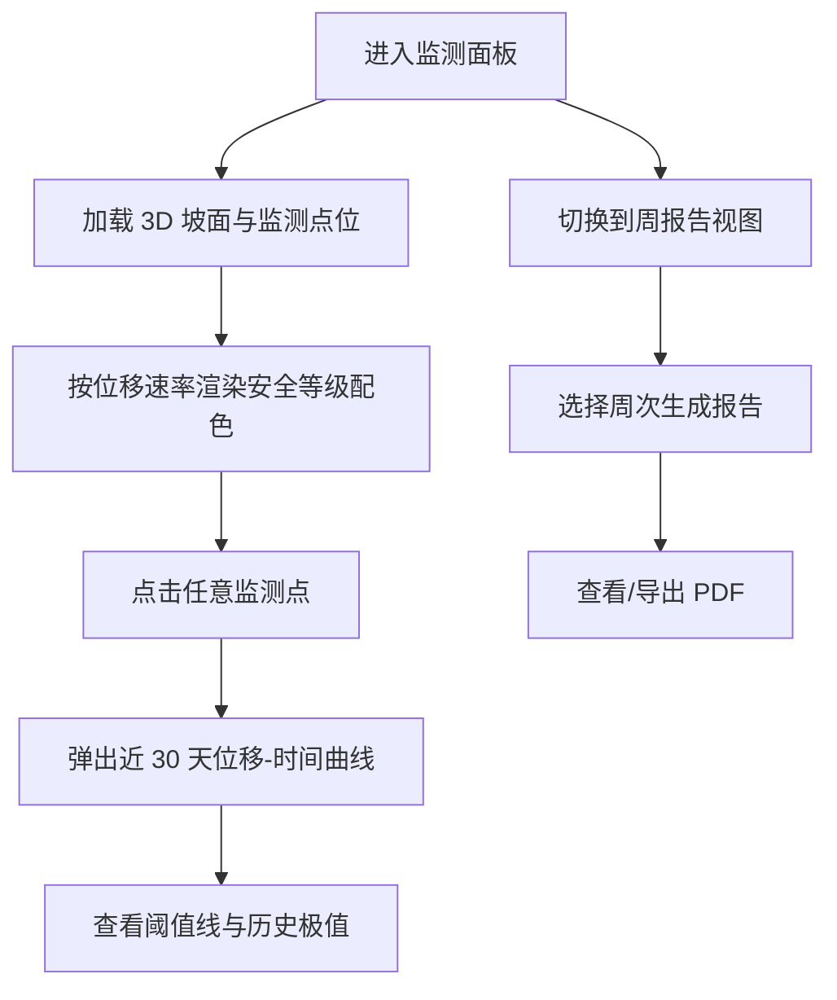

## 1. 产品概述

露天矿边坡安全监测面板，面向矿山安全管理人员，实时展示采场边坡与排土场边坡的位移监测数据，通过 3D 坡面示意图、四级安全等级配色、位移趋势曲线与周报功能，辅助边坡失稳风险预警与决策。

- 目标用户：矿山安全管理工程师、生产调度人员、矿长
- 核心价值：边坡位移监测可视化、风险等级一目了然、历史趋势回溯、自动化周报

## 2. 核心功能

### 2.1 功能模块

1. **总览仪表盘**：统计卡片（监测点数、各级预警数、最新采集时间）、安全等级图例
2. **3D 坡面示意图**：采场边坡、排土场边坡分区展示，GNSS 与雷达监测点位按坐标映射，颜色实时反映安全等级
3. **监测点详情弹窗**：近 30 天水平位移 / 垂直位移 / 位移速率曲线，带报警阈值参考线
4. **周监测报告**：自动汇总一周数据，含各监测点统计、超标情况、趋势分析，支持导出

### 2.2 页面详情

| 页面名称 | 模块名称 | 功能描述 |
|---|---|---|
| 总览仪表盘 | 统计卡片 | 展示总监测点数、绿/黄/橙/红四级数量、最新数据时间戳 |
| 总览仪表盘 | 3D 坡面示意图 | ECharts GL 坡面图，叠加监测点散点，支持旋转缩放，按颜色标识等级 |
| 总览仪表盘 | 监测点列表 | 表格列出所有监测点（名称、类型、位置、水平位移、垂直位移、速率、等级），支持筛选与排序 |
| 监测点详情弹窗 | 位移趋势曲线 | 近 30 天多指标折线图，标注 2/5/10mm/天 报警阈值线 |
| 周监测报告 | 报告预览与导出 | 自动生成当周或历史周报，文字总结 + 图表，支持 PDF/打印 |

## 3. 核心流程

## 4. 用户界面设计

### 4.1 设计风格

- **主色调**：深空黑 / 工业蓝（#0B1220 背景），突出工业监控大屏质感
- **安全等级配色**：
  - 绿色安全 `#22c55e`（<2mm/天）
  - 黄色预警 `#eab308`（2-5mm/天）
  - 橙色警示 `#f97316`（5-10mm/天）
  - 红色报警 `#ef4444`（>10mm/天）
- **字体**：标题使用等宽工业感字体，正文使用现代无衬线字体
- **布局**：顶部标题栏 + 左侧统计卡片区 + 中央 3D 视图 + 右侧监测点列表，大屏式布局
- **图标**：使用 Lucide 线性图标，保持科技感

### 4.2 页面设计概述

| 页面名称 | 模块名称 | UI 元素 |
|---|---|---|
| 总览仪表盘 | 顶部栏 | 系统标题、实时时钟、报告入口按钮 |
| 总览仪表盘 | 左侧统计卡 | 4 个等级数量卡 + 数据更新时间 |
| 总览仪表盘 | 中央 3D 区 | ECharts GL 坡面、可交互监测点、图例 |
| 总览仪表盘 | 右侧列表 | 监测点表格，可点击跳转详情 |
| 监测点详情弹窗 | 曲线图区 | 三条折线（水平/垂直/速率）+ 阈值标线 + 鼠标悬浮提示 |
| 周监测报告 | 报告页 | 报告标题、统计摘要、图表、结论与建议 |

### 4.3 响应性

桌面优先（1920×1080），自适应缩放，监测点列表支持内部滚动。

### 4.4 3D 场景指引

- 坡面采用伪 3D 高度图模拟露天矿台阶形态，采场与排土场分别建模
- 环境光 + 方向光，突出坡面立体层次
- 监测点为发光球体，按等级颜色并带脉冲动画
- 鼠标拖拽旋转视角，滚轮缩放
