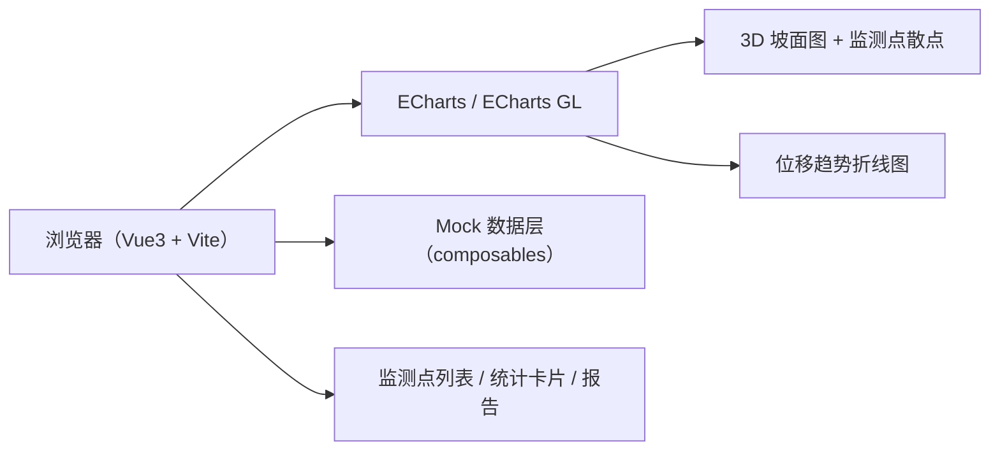

## 1. 架构设计



## 2. 技术说明

- **前端框架**：Vue 3.4 + TypeScript + Vite 5
- **样式方案**：Tailwind CSS 3
- **图表引擎**：echarts 5 + echarts-gl 2（3D 坡面、散点、折线）
- **图标**：lucide-vue-next
- **状态管理**：Vue Composition API（ref / reactive / computed），不引入额外状态库
- **数据来源**：前端内置 Mock 数据生成器（composable: useMockData），模拟每小时上报的位移数据
- **后端**：无（纯前端演示项目）

## 3. 路由定义

| 路由 | 用途 |
|---|---|
| `/` | 总览仪表盘（含 3D 坡面、监测点列表、统计卡） |
| `/report` | 周监测报告页 |

## 4. 数据模型

### 4.1 监测点定义

```ts
type MonitorType = 'GNSS' | 'Radar'
type SlopeArea = 'stope' | 'dump' // 采场 / 排土场
type SafetyLevel = 'safe' | 'warn' | 'alert' | 'danger'

interface MonitorPoint {
  id: string
  name: string
  type: MonitorType
  area: SlopeArea
  // ECharts GL 3D 坐标 [x, y, z]
  position: [number, number, number]
  // 当前值
  horizontalDisplacement: number  // mm
  verticalDisplacement: number    // mm
  displacementRate: number        // mm/天
  level: SafetyLevel
  updatedAt: string
}
```

### 4.2 历史数据

```ts
interface DisplacementRecord {
  timestamp: string  // ISO
  horizontal: number // mm
  vertical: number   // mm
  rate: number       // mm/天
}
```

### 4.3 安全等级阈值

| 等级 | 位移速率（mm/天） | 颜色 |
|---|---|---|
| safe   | < 2  | #22c55e |
| warn   | 2-5  | #eab308 |
| alert  | 5-10 | #f97316 |
| danger | >10  | #ef4444 |

## 5. 目录结构

```
src/
├── components/
│   ├── Slope3DView.vue          # ECharts GL 3D 坡面与监测点
│   ├── StatCard.vue             # 统计卡片
│   ├── MonitorTable.vue         # 监测点列表
│   ├── PointDetailModal.vue     # 详情弹窗 + 位移曲线
│   ├── WeeklyReport.vue         # 周报告组件
│   └── TopBar.vue               # 顶部标题栏
├── composables/
│   ├── useMockData.ts           # Mock 数据生成
│   └── useSafetyLevel.ts        # 安全等级计算
├── pages/
│   ├── Dashboard.vue            # 总览仪表盘
│   └── Report.vue               # 报告页
├── router/
│   └── index.ts
├── types/
│   └── index.ts
├── App.vue
└── main.ts
```

## 6. 关键实现要点

1. **3D 坡面**：使用 `echarts-gl` 的 `surface` 系列，基于数学函数生成露天矿台阶高度图；再用 `scatter3D` 叠加监测点，支持 `click` 事件触发详情弹窗。
2. **位移曲线**：`useMockData` 为每个监测点生成近 30 天（720 条）逐小时数据，弹窗内使用 ECharts `line` + `markLine` 绘制 2/5/10mm/天阈值线。
3. **自动滚动**：列表与图表独立管理定时器，避免耦合；图表滚动使用 ECharts 原生 `dataZoom`。
4. **周报告**：按周聚合 Mock 数据，输出统计摘要 + 趋势图，通过浏览器打印另存为 PDF。
